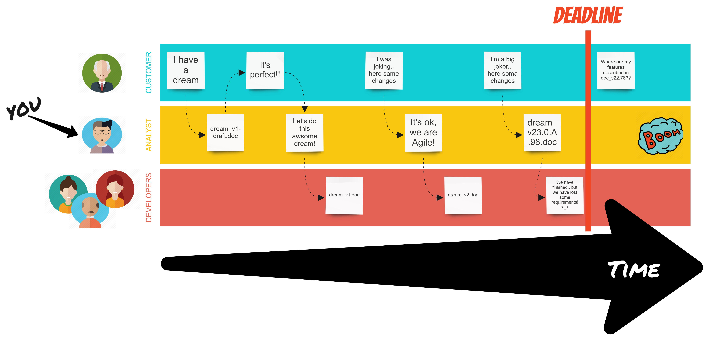
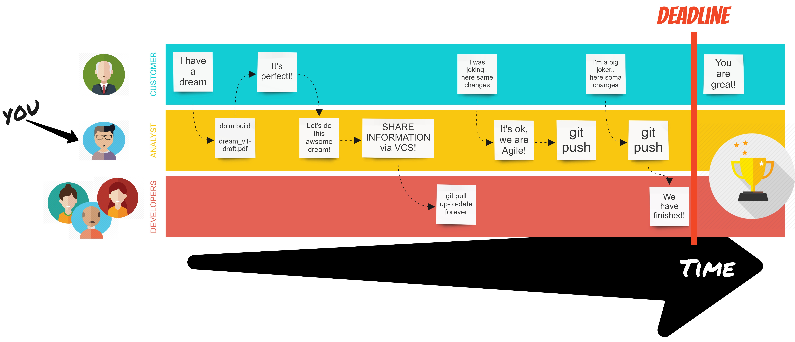

# DOLM

DOLM _(Document Lifecycle Management)_ is a maven plugin for managing documentation across developers and managers using markdown.

## Purpose

The AGILE MANIFESTO says 
> Working software over comprehensive documentation

but this is interpreted as "no more documentation"!

So DOLM wants to give to the team the possibility to maintain the project's docs in a easy way, leaving out the boring process of opening a text-editor, modifying the contents and then send the file via email to the work group.

DOLM aims to integrate the documentation writing in a typical software project:
* you can now define an easy and straightforward process that allows you to integrate updating the documentation in the development process
* gives all the team members the power to update the docs
* the source code can be versioned alongside the documentation
* all the functional changes are well tracked
* with a plain-text-document you can view the difference between doc versions
* all the team is constantly informed of the changes: an email can be ignored, but you must update your VCS before commit

The analyst can create and update the functional documentation using his VCS and build a nice PDF (for now) for the customers or the top management who don't know what markdown is.

The software developer team can create and update the technical documentation using their VCS and build a nice PDF (for now) for the software analysts.

This simplifies the sharing of documentation, improving the communication process between analysts and developers.

The aim is: all the team must be up-to-date and the requirements must be available to everyone, avoiding oversights or human errors like forgetting an attachment.

### Process
If your situation is this ("Agile" in this image is an ideal not a fact):



You can switch to this (git in the example isn't mandatory):



Adopting a better communication between analysts and developers, but without forcing your customers to change their habits (receive documentation via email or something similar).

### Features
1. Converting all the `.md` files in a directory to PDF files in an output directory
2. Automatic versioning of the output name of the pdf's _(es: README-v1.0.0.pdf)_

#### Known Limits
+ The image's paths inside the `.md` file must be absolute
+ The tables aren't styled

## Usage

### Installation
Once you [installed the lib](https://maven.apache.org/guides/mini/guide-3rd-party-jars-local.html) on your local machine, simply add to your pom's:
```
<build>
  <plugins>
    <plugin>
      <groupId>it.eomm.tools</groupId>
      <artifactId>dolm-maven-plugin</artifactId>
      <version>LATEST</version>
      <executions>
        <execution>
        <id>build-nice-docs</id>
        <goals>
          <goal>build</goal>
        </goals>
        <configuration>
            <sourcePath>${project.basedir}/src/main/resources/docs/functional</sourcePath>
            <documentVersion>9.0.8</documentVersion>
            <filenamePatternOutput>%4$td_%1$s-%2$s.%3$s</filenamePatternOutput>
        </configuration>
        </execution>
      </executions>
    </plugin>
  </plugins>
</build>
```

### Run
After the installation you can run the build goal by issuing:
    
    mvn dolm:build
    
or using the default maven lifecycle:

    mvn pre-site
    mvn site

or, of course, you can customize the phase executions of the plugin by specifying the `<phase>` tag on the `<execution>` declaration.

### Goals
Goal | Default Phase | Description |
--- | --- | --- |
`build`|`pre-site`|Convert all the files in the `${sourcePath}` that match `${filter}` and save them in the `${outputPath}` with the `${filenamePatternOutput}` filename|


### Parameters
Name | Description | Default value
--- | --- | --- |
sourcePath | Directory from where the `md` files are read | src\main\resources\docs
outputPath | Directory where the output files are stored  | target\docs
filter | Pattern to ignore some filenames | `(.)*md$`
documentVersion|The document version tag to apply|`${project.version}`
filenamePatternOutput|Customize the file name of the output files by `String.format`|`%1$s.%3$s`

#### Filename Pattern
This table lists the parameters passed to the `String.format` method.

Code | Description
--- | --- |
%1$s | source filename (without extension)
%2$s | ${documentVersion} parameter
%3$s | output file format (eg: pdf)
%4$td | current day
%4$tm | current month
%4$ty | current 2 digit's year
%4$tY | current 4 digit's year


### Test
Simply run `mvn clean test`

### Next steps
+ :white_check_mark: JUnit 
+ :white_check_mark: Better integration in the maven lifecycle
+ :hourglass_flowing_sand: Deploy on [mvn-repository](http://central.sonatype.org/)
+ :white_medium_square: Add a template system to the `.md` files
+ :white_medium_square: Customize the output file format (`docx`, `odt`, ecc...)

### Dependancies
+ [com.atlassian.commonmark](https://github.com/atlassian/commonmark-java) for converting markdown to html
+ [com.itextpdf](http://itextpdf.com/) for building the PDF from an html string